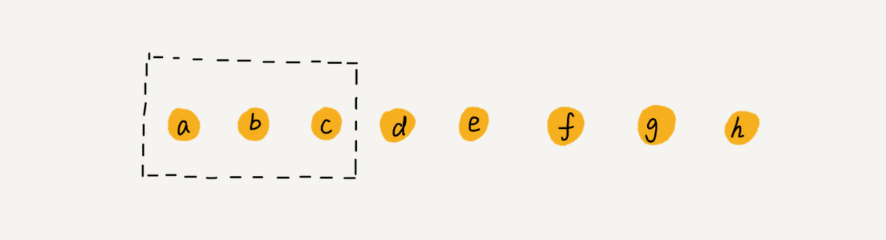

## Array
* Array is a linear list
* Required a continues memory address to store data. 它用一组连续的内存空间来存储数据
  

   ```c++
   a[i]_address = base_address + i * data_type_size
   ```

##### Linear List
* Array, LinkList, Quene, Stack
##### Non-linear:
* Tree, Graph

### Low performance in insert and delete?

**Yes**, because it a continues dataset, which means when some values need to be insert in between others, the values after the insertion place need to move more one slot. samething as delete.

##### Anyway to improve?

  The answer is **Yes**
* **For insert**, if the array doesn't care about the order, just put the orignal value to the end. like the following grap, when X is insert, x replace c, and move c to the end


* **For delete**, just make the element to be delete, but don't delete it until run out of slot. 
  * Why it benefit? because if we delete everytime, we need to deal with(move) the other element everytime as well, but if we delete one time, we only need to deal with(move) other element once. **Same idea in GC in Java**

 

## Container basd Array: ex ArrayList in java
* Advantage:
  * easy to Scale
  * handy tool which encapsule details methods like insert, delete.
* Disadvantage:
  * have to autoboxing premitive type like int, long before use it.
  * it not that necessary when array have a fixed number of items
  * when comes to multiply dimensional array, array is easy to understand than array list:
    ```java
    array[][]
    ArrayList<ArrayList> array
    ```


## Reference resource：
* [极客时间：算法与数据结构之美](https://time.geekbang.org/column/126)
